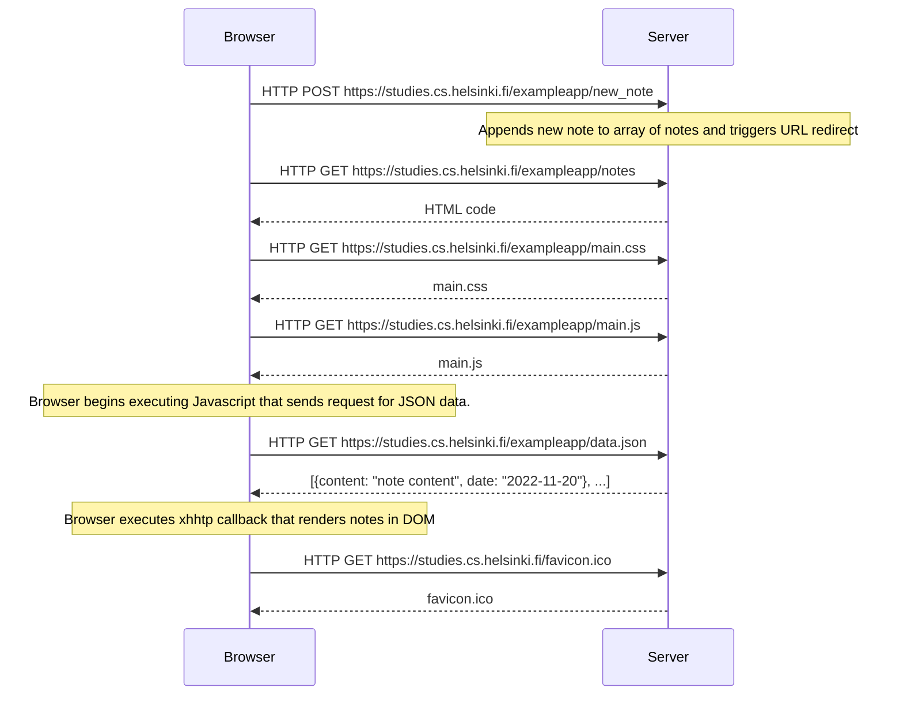

# 0.4: New Note

```mermaid
sequenceDiagram
Browser->>Server: HTTP POST https://studies.cs.helsinki.fi/exampleapp/new_note
Note over Server: Appends new note to array of notes and triggers URL redirect
Browser->>Server: HTTP GET https://studies.cs.helsinki.fi/exampleapp/notes
Server-->>Browser: HTML code
Browser->>Server: HTTP GET https://studies.cs.helsinki.fi/exampleapp/main.css
Server-->>Browser: main.css
Browser->>Server: HTTP GET https://studies.cs.helsinki.fi/exampleapp/main.js
Server-->>Browser: main.js
Note over Browser: Browser begins executing Javascript that sends request for JSON data.
Browser->>Server: HTTP GET https://studies.cs.helsinki.fi/exampleapp/data.json
Server-->>Browser: [{content: "note content", date: "2022-11-20"}, ...]
Note over Browser: Browser executes xhhtp callback that renders notes in DOM
Browser->>Server: HTTP GET https://studies.cs.helsinki.fi/favicon.ico
Server-->>Browser: favicon.ico
```