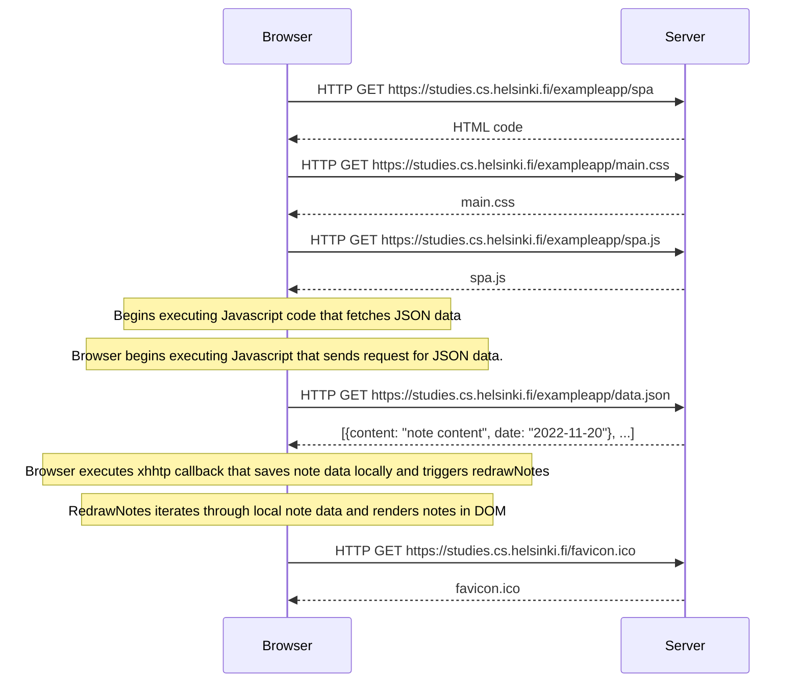

# 0.5 SPA

```mermaid
sequenceDiagram
Browser->>Server: HTTP GET https://studies.cs.helsinki.fi/exampleapp/spa
Server-->>Browser: HTML code
Browser->>Server: HTTP GET https://studies.cs.helsinki.fi/exampleapp/main.css
Server-->>Browser: main.css
Browser->>Server: HTTP GET https://studies.cs.helsinki.fi/exampleapp/spa.js
Server-->>Browser: spa.js
Note over Browser: Begins executing Javascript code that fetches JSON data
Note over Browser: Browser begins executing Javascript that sends request for JSON data.
Browser->>Server: HTTP GET https://studies.cs.helsinki.fi/exampleapp/data.json
Server-->>Browser: [{content: "note content", date: "2022-11-20"}, ...]
Note over Browser: Browser executes xhhtp callback that saves note data locally and triggers redrawNotes
Note over Browser: RedrawNotes iterates through local note data and renders notes in DOM
Browser->>Server: HTTP GET https://studies.cs.helsinki.fi/favicon.ico
Server-->>Browser: favicon.ico
```