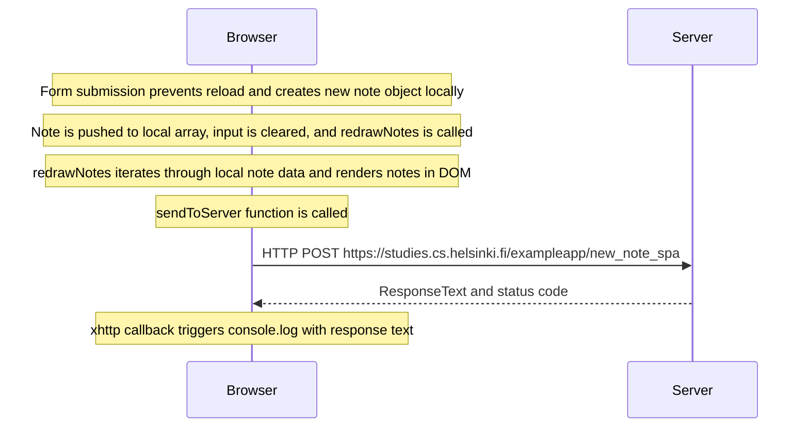

# 0.6 New Note

```mermaid
sequenceDiagram
Note over Browser: Form submission prevents reload and creates new note object locally
Note over Browser: Note is pushed to local array, input is cleared, and redrawNotes is called
Note over Browser: redrawNotes iterates through local note data and renders notes in DOM
Note over Browser: sendToServer function is called
Browser->>Server: HTTP POST https://studies.cs.helsinki.fi/exampleapp/new_note_spa
Server-->>Browser: ResponseText and status code
Note over Browser: xhttp callback triggers console.log with response text
```